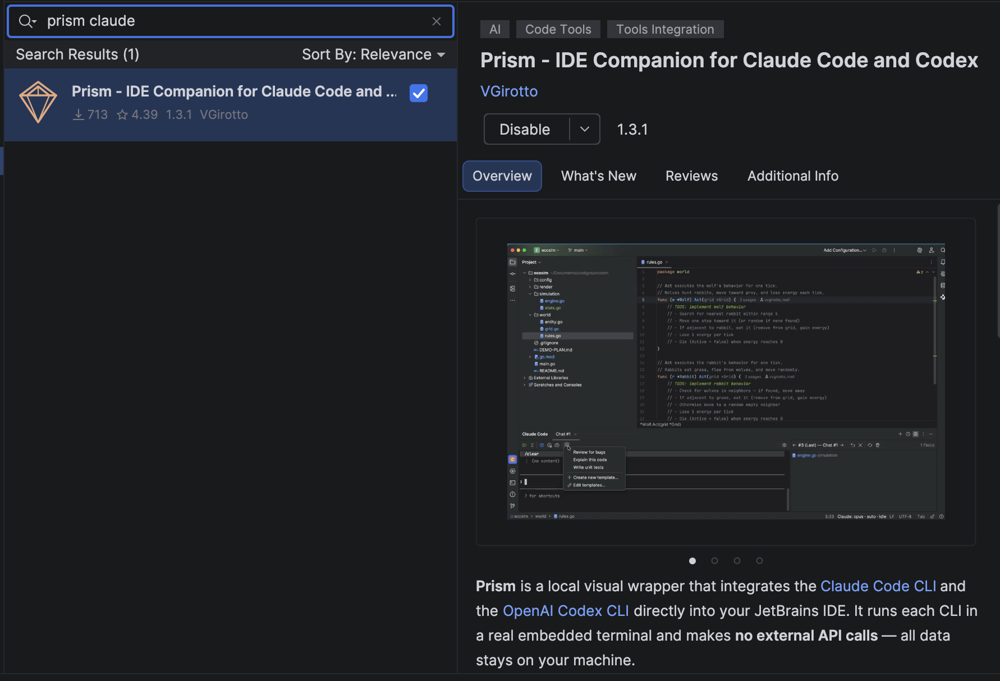
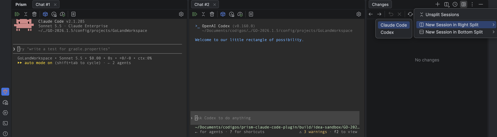
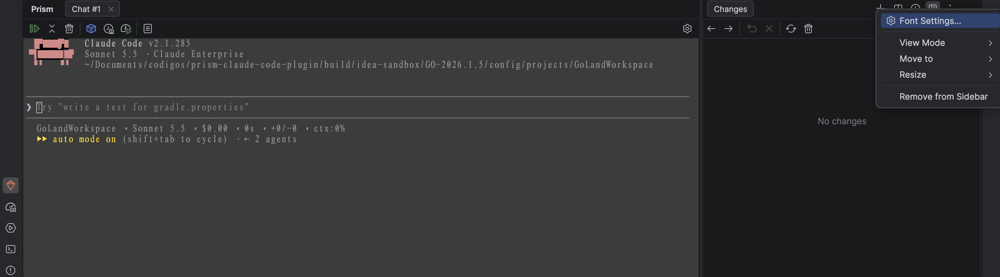

#  Prism — IDE Companion for Claude Code and Codex

[](https://github.com/VGirotto/prism-claude-code-plugin/releases)
[](LICENSE)
[](https://plugins.jetbrains.com/plugin/31025-prism--ide-companion-for-claude-code-and-codex)

> [Leia em Português](README.pt-BR.md)

A full-featured JetBrains plugin that integrates both the **Claude Code CLI** and the **OpenAI Codex CLI** directly into your IDE — with a graphical interface, per-interaction diff view, conversation history, and multiple sessions in tabs or split panes.

Prism is a **local visual wrapper** — it spawns each agent CLI via a real PTY and makes **no external API calls**. You must have the CLI(s) installed and authenticated independently.


> **Disclaimer:** This is an unofficial community plugin, not affiliated with or endorsed by Anthropic, PBC or OpenAI. "Claude" and "Claude Code" are trademarks of Anthropic, PBC. "Codex" is a trademark of OpenAI.

---

## 🚀 Quick Install

> **3 steps to get started — no build required!**

### Prerequisites

| Requirement | Version | Notes |
|-------------|---------|-------|
| 🖥️ **JetBrains IDE** | 2024.3+ | IntelliJ IDEA, GoLand, WebStorm, PyCharm, CLion |
| 🤖 **Claude Code CLI** | 1.0+ | `npm install -g @anthropic-ai/claude-code` (optional if you only use Codex) |
| 🧠 **Codex CLI** | 0.10+ | `npm install -g @openai/codex` (optional if you only use Claude) |

At least one of the two CLIs is required. The "New Session" button shows a picker when both are installed.

### Option 1: JetBrains Marketplace (Recommended) ⭐

Install directly from the [**JetBrains Marketplace**](https://plugins.jetbrains.com/plugin/31025-prism--ide-companion-for-claude-code-and-codex), the official JetBrains plugin catalog — quick and easy.

1. ⚙️ Open **Settings → Plugins → Marketplace** in your IDE
2. 🔎 Search for **Prism - IDE Companion for Claude Code and Codex** and click **Install**
3. 🚀 Restart the IDE if prompted, then open **View → Tool Windows → Prism**

That's it! 🎉 You can manage future updates from **Settings → Plugins → Installed**.



### Option 2: Download from GitHub Releases 📦

1. 📦 Download the latest `.zip` from [**Releases**](https://github.com/VGirotto/prism-claude-code-plugin/releases)
2. ⚙️ In the IDE: **Settings → Plugins → ⚙️ Gear icon → Install Plugin from Disk**
3. 🚀 Restart the IDE if prompted, then open **View → Tool Windows → Prism**

### Option 3: Build Locally 🔧

<details>
<summary>Click to expand build instructions</summary>

```bash
git clone https://github.com/VGirotto/prism-claude-code-plugin.git
cd prism-claude-code-plugin

# Set JAVA_HOME to a JDK 21 installation
export JAVA_HOME="/path/to/jdk-21"

./gradlew buildPlugin

# Install: Settings > Plugins > Install Plugin from Disk
# Select: build/distributions/*.zip
```

</details>

---

## 🎬 Features in Action

### 🖥️ Interactive Terminal

Full agent terminal running inside the IDE with ANSI color support and real PTY (pty4j + JediTerm). Pick Claude Code or Codex when starting a new session.

Compact toolbar with quick actions: **Resume**, **Compact**, **Clear**, **Model**, **Effort**, **Cost**, **Templates**, and **Settings**. Every button works in both Claude Code and Codex sessions, mapped to each agent's own commands (for example, **Cost** runs `/cost` for Claude and opens Codex's `/usage` token-activity views).


---

### 📝 Agent Changes Panel

Automatic diff view of all files modified per interaction — native IDE side-by-side diff with history navigation between interactions. Works for both Claude and Codex sessions.


Navigate through interaction history:


Revert per file or per entire interaction with a single click:


---

### 🖱️ Context Menu & IDE Integration

Right-click in editor to access: **Explain** / **Review** / **Fix** / **Generate Tests** / **Refactor**.


- 📎 File reference with `@path` in the terminal
- 🎯 Auto-capture of context (active file, selection, open files)

---

### 🪟 Split Sessions

Keep Claude Code and Codex sessions visible at the same time, side by side or stacked. Open **Split Sessions** in the Prism title bar to:

- Move the selected session into a **right** or **bottom** split when multiple tabs are open in its pane.
- Create a **new independent session** directly in a right or bottom split, choosing Claude Code or Codex.
- Use **Unsplit Sessions** to bring the panes back together.

Each session keeps its own terminal and toolbar. Editor actions target the last focused Prism session. The split menu appears when the IDE supports Tool Window tab splitting.



---

### 📋 Prompt Templates & Multi-Session

Reusable [Prompt Templates](docs/prompt-templates.md) with `{selection}`, `{file}`, `{language}` variables. Keep multiple independent sessions in tabs, or use Split Sessions to view them together.


---

### 🕐 Conversation History

Browse past conversations with full-text search. Resume any previous session. The history view scopes to the active session's CLI:

- **Claude** sessions are read from `~/.claude/projects/<escaped-project-path>/*.jsonl`
- **Codex** sessions are read from `~/.codex/sessions/YYYY/MM/DD/rollout-*.jsonl` and filtered to the IDE project by `cwd`


---

### 🎨 Terminal Appearance & Font Settings

Prism uses the IDE's terminal settings, so you can customize its appearance:

- **Font, size, and line spacing**: open **Settings → Tools → Terminal → Font Settings**. On IDEs 2025.1.1+, the Prism options menu (**⋮ → Font Settings…**) takes you there directly. Changes apply to open Prism terminals, and **Ctrl+mouse wheel** adjusts the font size.
- **Colors**: adjust the terminal palette in **Settings → Editor → Color Scheme → Console Colors**. The agent CLI's own theme also affects how its output looks.

On older IDEs, font settings are under **Settings → Editor → Color Scheme → Console Font**. The gear button in the agent toolbar opens **Prism settings**; the **Font Settings** entry is in the tool window's options menu.



---

### ⚙️ Settings

Configure shell, **default agent**, **Claude path**, **Codex path**, language, exclusions, auto-start, and toggles.
Snapshot exclusions accept comma-separated names or wildcard patterns, for example `node_modules`, `cmake-build-*`, or `**/generated`.


---

## ⌨️ Keyboard Shortcuts

| Shortcut | Action | Platform |
|----------|--------|----------|
| `Cmd+Shift+C` | Toggle Prism | macOS |
| `Alt+Shift+C` | Toggle Prism | Linux/Windows |
| `Ctrl+Shift+D` | Show Agent Changes (diff) | macOS |
| `Ctrl+Alt+Shift+D` | Show Agent Changes (diff) | Linux/Windows |
| `Ctrl+Shift+Enter` | Send selection to agent | macOS |
| `Ctrl+Alt+Shift+Enter` | Send selection to agent | Linux/Windows |
| `Ctrl+Shift+K` | Insert @file reference | macOS |
| `Ctrl+Alt+Shift+K` | Insert @file reference | Linux/Windows |

> On macOS, `Ctrl` refers to the physical Control key (not Cmd).

#### Paste in the agent terminal (Linux)

On Linux, `Ctrl+V` inspects the system clipboard: if it holds an image, the image bytes are written to a temporary PNG and the file path is pasted into the prompt (the agent attaches the file). Otherwise the clipboard text is pasted (wrapped in bracketed-paste escapes, so multi-line content doesn't auto-submit). Use `Ctrl+Shift+V` to force a plain-text paste. On macOS and Windows, `Ctrl+V` keeps its native agent CLI behavior.

### 🔗 Quick Access

- **IDE Menu**: `Tools > Toggle Prism`
- **Settings**: `Settings > Tools > Prism`
- **Status Bar**: Click the widget to open the agent panel

---

## 🤝 Contributing

See [CONTRIBUTING.md](CONTRIBUTING.md) for development setup, build commands, and contribution workflow.

Found a bug or have an idea? Open an [Issue](https://github.com/VGirotto/prism-claude-code-plugin/issues) 🐛

---

## 📚 Documentation

- [Prompt Templates Guide](docs/prompt-templates.md)
- [Architecture & Project Structure](docs/architecture.md)

---

## 📄 License

Apache License 2.0 — see [LICENSE](LICENSE) for details.
